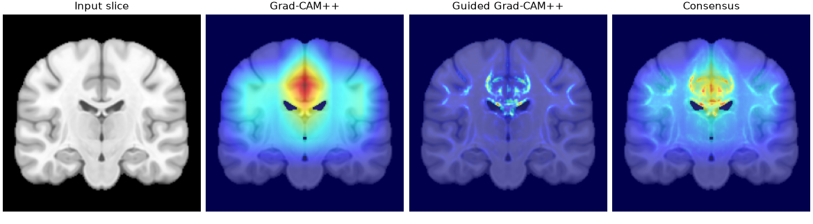
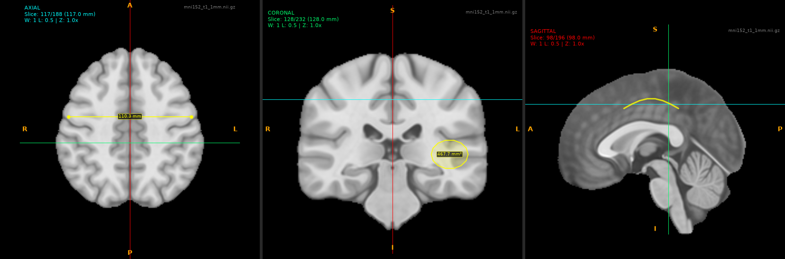

# NeuroXAI: explainable early Alzheimer's detection for clinics with limited resources

[](https://github.com/falahsheikh/NeuroXAI/actions/workflows/tests.yml)
[](https://doi.org/10.1117/12.3088200)

This repository contains the software for the paper
[NeuroXAI: Lightweight Explainable Early Alzheimer's Detection for Resource-Constrained Clinical Settings](https://doi.org/10.1117/12.3088200)
(SPIE Medical Imaging 2026: Imaging Informatics).

NeuroXAI has two desktop applications:

- The **Slice Viewer** shows MRI volumes in the axial, coronal and sagittal planes.
  It has tools for annotation and measurement.
- The **Analysis Tool** classifies one coronal MRI slice as cognitively normal (CN),
  early mild cognitive impairment (EMCI) or late mild cognitive impairment (LMCI).
  It shows Grad-CAM++, Guided Grad-CAM++ and consensus maps for each prediction.



> **Note:** NeuroXAI is research software. It is not a medical device. Do not use it for diagnosis.

## Installation

1. Install Python 3.11 with Tkinter.
   The installers from python.org include Tkinter.
   On Ubuntu, install the `python3-tk` package.
2. Make a virtual environment and activate it:

   ```bash
   python3.11 -m venv .venv
   source .venv/bin/activate
   ```

3. Install the dependencies:

   ```bash
   pip install -r requirements.txt
   ```

4. Run the tests:

   ```bash
   pytest
   ```

Run all the commands in this README from the root folder of the repository.

## Slice Viewer

Start the Slice Viewer. The volume is optional:

```bash
python -m neuroxai.viewer [volume.nii.gz]
```

Click **Load Volume** to open a NIfTI (`.nii`, `.nii.gz`) or MetaImage (`.mhd`) file.

| Function | Control |
| --- | --- |
| Move the crosshair | left mouse button on a view |
| Change the slice | slice sliders, or the mouse wheel on a view |
| Change the contrast | window and level sliders, or drag with the right mouse button |
| Zoom and pan | Ctrl + mouse wheel, **Zoom Select**, **Pan** or the middle mouse button; **Reset Zoom** (Ctrl+0) |
| Maximize a view | the button at the top right of the view (shows scales in mm) |
| Draw on a slice | **Draw**; select the color, brush size and opacity on the **Annotations** tab |
| Measure a distance or an area | **Measure** (two clicks) or **Area** (drag around the region); Esc cancels |
| Add a comment, delete | **Comment** and **Delete** on the **Annotations** tab |
| Undo or redo | **Undo** (Ctrl+Z), **Redo** (Ctrl+Y) |
| Save or load a session | **Save Session** (Ctrl+Shift+S), **Load Session** (Ctrl+Shift+O) |
| Save a report with snapshots | **Save Report** (Ctrl+S): the annotations that have a comment |
| Open the Analysis Tool | **Launch Analysis Tool** |

The Slice Viewer reorients each volume to LPS when it loads the volume.
Thus, the planes and the directions are correct for all file orientations.
The views use the radiological convention: the patient's right is on the left of the axial and coronal views.
Letters at the edges of each view show the directions.
Measurements use the voxel size of each axis.



## Analysis Tool

Start the Analysis Tool:

```bash
python -m neuroxai.analysis [--model model.keras] [--image slice.png]
```

You can also click **Launch Analysis Tool** in the Slice Viewer.

1. Wait until the status bar shows that the model is loaded.
2. Click **Open Slice** and select a coronal slice (PNG, JPEG, BMP or TIFF).
3. Examine the prediction, the class probabilities and the explanation maps.
   Click **Max** on a pane to make it larger.
4. To use a different layer, click **Explanation Layers**.
5. To keep the results, click **Save Report** and select a folder.
   The report contains each figure at 300 dpi, `summary.txt` and `summary.json`.

A slice of 224x224 pixels goes to the model without change,
because the slices from `extract_slices` (see [Preprocessing](#preprocessing)) have this size.
The tool crops a slice of a different size to the brain and puts it on a 224x224 canvas.

### Explanation methods

- **Grad-CAM++** (Chattopadhay et al., 2018).
  The default layer is `top_activation`, the final feature map that the classifier pools.
  **Explanation Layers** lists the other convolution layers.
- **Guided backpropagation** (Springenberg et al., 2015).
  A gradient goes through a rectifier only where its input and the gradient are both positive.
- **Guided Grad-CAM++** is the product of the two maps.
  A Gaussian filter (sigma 0.8 pixels) smooths the product.
- The **consensus map** is the mean of the Grad-CAM++ and Guided Grad-CAM++ maps,
  after each map is scaled to [0, 1].
- The **Class Maps** pane shows the Grad-CAM++ map of each class.

Both methods use the class score before the softmax.
A mask from Otsu thresholding keeps each map inside the brain.

### Other models

Click **Load Model** to use a different Keras model.
The model must have a 224x224x3 input, 3 outputs (CN, EMCI, LMCI) and a 2D convolution layer.
The tool identifies EfficientNetV2B0, MobileNetV2 and DenseNet121 backbones,
and it scales the input as their Keras application does.
The [eAlz](https://github.com/falahsheikh/eAlz) repository trains models of these types.
For other backbones, the model gets pixel values from 0 to 255.

## Model

`models/efficientnetv2b0.keras` is the model from the paper.

| Property | Value |
| --- | --- |
| Architecture | EfficientNetV2B0 (ImageNet weights, frozen), global average pooling, Dense(128, ReLU), Dense(3, softmax) |
| Parameters | 6,083,667 |
| Input | 224 x 224 RGB coronal slice |
| Classes | CN, EMCI, LMCI |
| Training data | coronal slices from ADNI |

The [eAlz](https://github.com/falahsheikh/eAlz) repository contains the training and evaluation code.

## Preprocessing

The ADNI data use agreement does not permit redistribution.
Thus, this repository contains no MRI data.
To use ADNI data, ask for access at [adni.loni.usc.edu](https://adni.loni.usc.edu).

1. Remove the skull with SynthStrip.
   The script uses the `freesurfer/synthstrip` Docker image, or `mri_synthstrip` from FreeSurfer.

   ```bash
   python -m neuroxai.preprocessing.skull_strip <input_folder> <output_folder>
   ```

2. Put the skull-stripped volumes in one folder for each class: `cn/`, `emci/` and `lmci/`.
3. Make 224x224 coronal PNG slices (30 slices in the middle of each volume):

   ```bash
   python -m neuroxai.preprocessing.extract_slices --input-dir <volumes_folder> --output-dir <slices_folder>
   ```

## Benchmark

Measure the time and memory that the Analysis Tool needs on your computer:

```bash
python -m benchmarks.benchmark --image <slice.png> --output results.json
```

`benchmarks/results/performance_results.json` contains the measurements in the paper
(8 CPU cores, 8 GB of memory, macOS).
The paper measured the first Grad-CAM++ call, which includes the time to build the TensorFlow graph.
The benchmark script measures each operation after one warm-up call.

## Repository contents

```
NeuroXAI/
├── neuroxai/
│   ├── viewer/             Slice Viewer (layout, rendering, input, annotation lists, files)
│   ├── analysis/           Analysis Tool (analysis pipeline, charts, panes, layer dialog, window)
│   ├── preprocessing/      skull stripping and slice extraction
│   ├── volume.py           volume loading, LPS orientation, slices and voxel sizes
│   ├── geometry.py         distances, areas, scales and zoom
│   ├── annotations.py      drawings and measurements, with undo and redo
│   ├── session.py          session files
│   ├── imaging.py          slice cropping and loading
│   ├── xai.py              Grad-CAM++, guided backpropagation and maps
│   ├── model_check.py      model checks and input scaling
│   └── config.py           class names and paths
├── models/efficientnetv2b0.keras
├── benchmarks/             benchmark script and the results in the paper
├── docs/images/            figures for this README
└── tests/                  tests with synthetic data (the GUI tests need a display)
```

## Changes

Version 1.2 (September 2026):

- The code is now the `neuroxai` package. Each module has one function, and the logic that
  the applications share has tests. Start the applications with `python -m`.
- Slice Viewer:
  - The viewer reorients each volume to LPS. Before, the planes and the direction labels were
    correct only for files in LPS orientation.
  - Distances, areas, aspect ratios, scales and slice positions use the voxel size of the correct axis.
    Before, they were correct only for volumes with the same voxel size on all axes.
  - A session file records a SHA-256 checksum of the volume. Before, the checksum changed at each start.
  - Undo and redo restore the correct annotations after **Clear All**.
  - A report can contain area measurements. Before, an area with a comment stopped the report.
  - The annotation lists show all annotations. **Comment** and **Delete** use the list of their own tab.
  - The status bar shows. The intensity has no unit, because MRI intensities are not Hounsfield units.
  - The 3D tab, which the viewer did not show, is removed.
- Analysis Tool:
  - The default Grad-CAM++ layer is `top_activation`, the final feature map. With `top_conv`, which comes
    before batch normalization and the activation, some maps were empty.
  - A 224x224 slice goes to the model without change, as in training.
    Before, the tool cropped it again, and this changed some predictions.
  - Custom models get the input scaling of their backbone. The tool rejects models that it cannot use.
  - The consensus map has no layer setting of its own, because it combines the two other maps.
  - The tool shows errors. Before, a failed map showed as an empty map.
  - The panes show no diagnosis, clinical recommendation, patient ID or scan date.
    The Class Maps pane replaces the diagonal confidence matrix.
- The benchmark script measures the quantities in `performance_results.json`.
  It replaces the two scripts that checked the system.

Version 1.1 (September 2026) corrects two parts of the explanation code:

- The Grad-CAM++ weights now use the equation from Chattopadhay et al. (2018).
- The guided backpropagation now changes the gradient at each rectifier.
  The earlier version masked only the input gradient.

## Citation

```bibtex
@inproceedings{sheikh2026neuroxai,
  title     = {{NeuroXAI}: Lightweight Explainable Early {Alzheimer's} Detection for Resource-Constrained Clinical Settings},
  author    = {Sheikh, Falah and Al Marouf, Ahmed and Alhajj, Reda and Rokne, Jon George},
  booktitle = {Medical Imaging 2026: Imaging Informatics},
  series    = {Proc. SPIE},
  volume    = {13930},
  pages     = {139301R},
  year      = {2026},
  doi       = {10.1117/12.3088200}
}
```

## License

[CC BY-NC 4.0](LICENSE)

## Acknowledgments

The data for this work came from the ADNI database (adni.loni.usc.edu).
An Alberta Innovates Summer Research Studentship supported this work.
